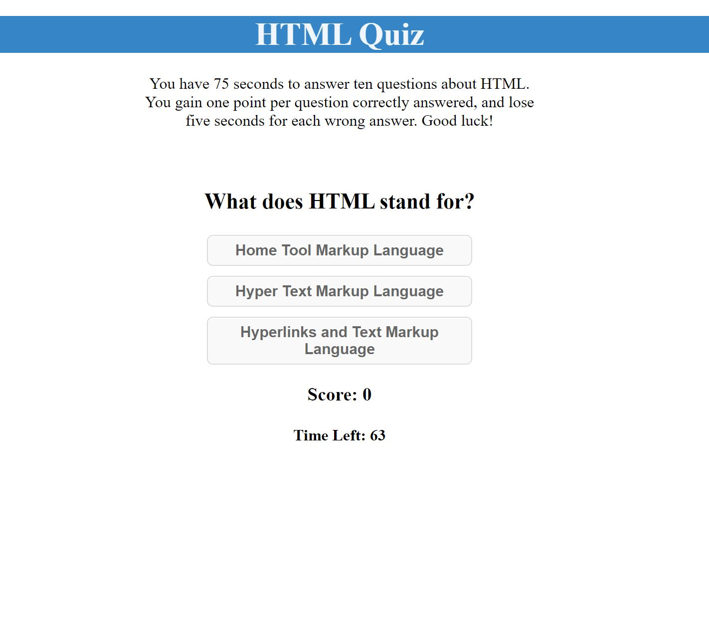

# Web APIs-Online Quiz

## Description

This is a project that is meant to demonstrate the power of Web APIs, as well as practice the use of HTML, CSS, and Javascript.

The site is a ten question quiz with a timer and a high scores list stored in local storage.

The game starts with instructions, a start button, and a high scores button. When the game is started, the user is shown a question, answers as buttons, their score, and the timer. To progress, the user chooses an answer, and if it is correct a point is added to their score. If they choose the wrong answer, time is subtracted from the timer.

This project shows the power of using the DOM. By using the DOM we can add HTML elements to the page as a user interacts with it, rather than having all elements display at once. This makes the page interactive and dependent on user input.

This project also demonstrates the use of local storage. Users can input their name and high score, which is then saved and can be accessed later by the same user.

## Installation

You can find the deployed site [here.](https://allysonmcgrath.github.io/apis-online-quiz/)

To install the entire project and access the code, you can clone the repository by using the command prompt

$ git clone https://github.com/AllysonMcGrath/cbcchallenge4.git

Detailed instructions for cloning GitHub repositories can be found [here.](https://docs.github.com/en/github/creating-cloning-and-archiving-repositories/cloning-a-repository-from-github/cloning-a-repository)

## Usage

You can find the site [here](https://allysonmcgrath.github.io/apis-online-quiz/).

When displaying correctly, website should look like the image below:

Use standard git commands within this repository.

Examples:

$ git mv index.html ../
$ git add .
$ git commit -m "commit description"
$ git push origin main

## Credits

Trilogy Education Services, LLC, a 2U, Inc. brand

[Coding Boot Camp at UT](https://github.com/the-Coding-Boot-Camp-at-UT)

Button CSS styles are from [bestcssbuttongenerator](https://www.bestcssbuttongenerator.com/#/28) and [W3Docs](https://www.w3docs.com/snippets/css/how-to-style-buttons-with-css.html).

List CSS styles are from [freefrontend.com](https://freefrontend.com/css-lists/)

James Q Quick provided tutorials on local storage [here](https://www.youtube.com/watch?v=jfOv18lCMmw) and [here](https://www.youtube.com/watch?v=DFhmNLKwwGw).

Quiz Questions are from [W3Schools](https://www.w3schools.com/quiztest/quiztest.asp?qtest=HTML).

## License

MIT License

Copyright (c) 2021 Allyson McGrath

Permission is hereby granted, free of charge, to any person obtaining a copy
of this software and associated documentation files (the "Software"), to deal
in the Software without restriction, including without limitation the rights
to use, copy, modify, merge, publish, distribute, sublicense, and/or sell
copies of the Software, and to permit persons to whom the Software is
furnished to do so, subject to the following conditions:

The above copyright notice and this permission notice shall be included in all
copies or substantial portions of the Software.

THE SOFTWARE IS PROVIDED "AS IS", WITHOUT WARRANTY OF ANY KIND, EXPRESS OR
IMPLIED, INCLUDING BUT NOT LIMITED TO THE WARRANTIES OF MERCHANTABILITY,
FITNESS FOR A PARTICULAR PURPOSE AND NONINFRINGEMENT. IN NO EVENT SHALL THE
AUTHORS OR COPYRIGHT HOLDERS BE LIABLE FOR ANY CLAIM, DAMAGES OR OTHER
LIABILITY, WHETHER IN AN ACTION OF CONTRACT, TORT OR OTHERWISE, ARISING FROM,
OUT OF OR IN CONNECTION WITH THE SOFTWARE OR THE USE OR OTHER DEALINGS IN THE
SOFTWARE.
